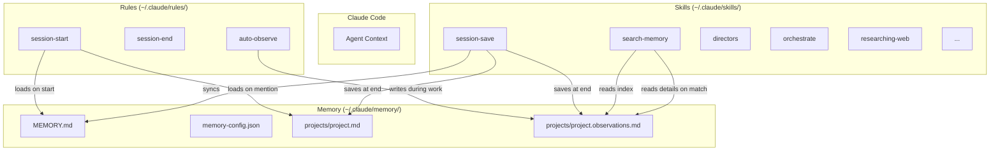
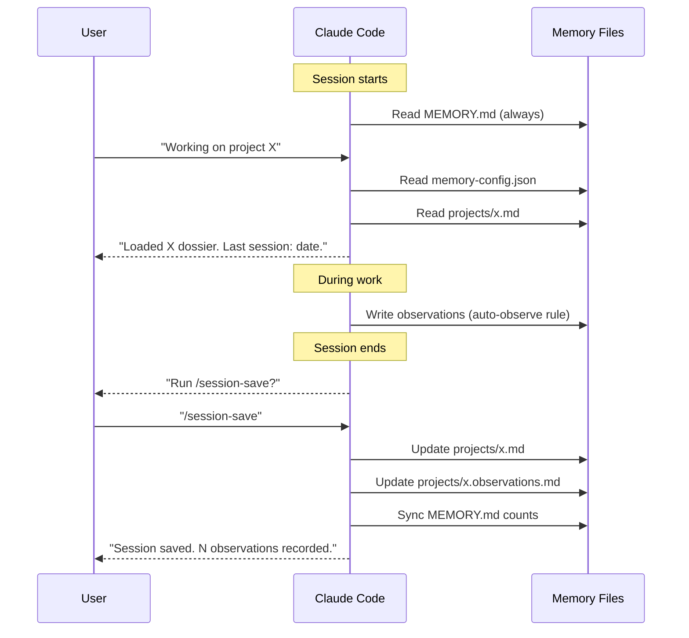
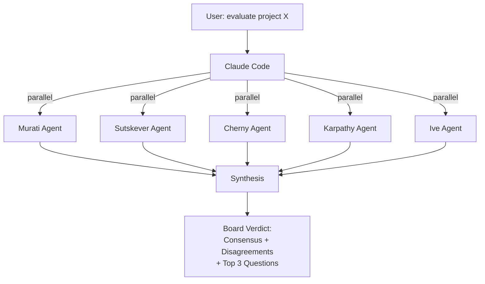
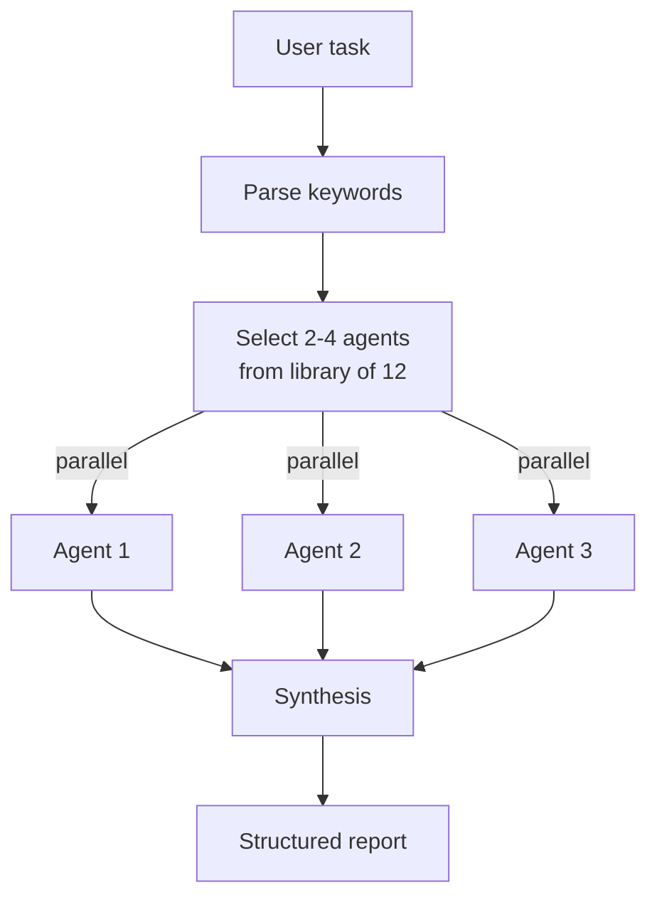

# Architecture

How Miracle Infrastructure works under the hood. Diagrams, data flow, and token economics.

## System Overview

The system is a set of Markdown files that Claude Code reads as skills and rules. No server, no database, no runtime. Files on disk, read by the agent.



## Session Lifecycle



## Memory Hierarchy

Progressive disclosure: load minimum needed, expand on demand.

```
Level 0: MEMORY.md
  Always in context. Project index, open problems, workflow.
  Cost: ~200 tokens.

Level 1: project.md (dossier)
  Loaded when project is mentioned.
  Status, architecture, decisions, next steps.
  Cost: ~800 tokens.

Level 2: project.observations.md (Index only)
  Loaded during search. Just the table.
  Cost: ~40 tokens per row.

Level 3: project.observations.md (Details)
  Loaded only for matching entries.
  Before/After, Files, Why.
  Cost: ~150 tokens per row.
```

### Token economics

| Scenario | Tokens loaded | Without progressive disclosure |
|----------|--------------|-------------------------------|
| Session start (1 project) | ~1,000 | ~1,000 (same) |
| Search across 10 projects, 100 observations, 5 matches | ~4,750 | ~15,000 |
| Full scan of all observations | ~15,000 | ~15,000 (same) |

The savings come from Level 2 to Level 3 transitions. The index is always cheap. Details are expensive and loaded selectively.

## Observation Data Model

```
Observation:
  number: sequential integer (1, 2, 3...)
  date: YYYY-MM-DD
  type: decision | bugfix | feature | discovery | problem
  summary: string (max 50 chars)
  files: affected file paths

  # Details (Level 3)
  before: state before the change
  after: state after the change
  why: rationale / context
  resolved: date + description (for problems)
```

Types are extensible via `memory-config.json`.

## Config-Driven Architecture

Instead of hardcoded mappings, all project routing goes through `memory-config.json`:

```json
{
  "memory_path": "~/.claude/memory",
  "projects": {
    "my-app": {
      "keywords": ["my-app", "dashboard"],
      "github": "user/my-app",
      "path": "~/projects/my-app"
    }
  },
  "fallback_project": "general",
  "max_dossier_lines": 200,
  "observation_types": ["decision", "bugfix", "feature", "discovery", "problem"]
}
```

The `session-start` rule reads this config at the start of every session. Keywords match user input to project dossiers. The `path` field enables matching by working directory.

## Integrity Validation

`test_memory_integrity.py` validates:

1. MEMORY.md structure (required sections, line count, no secrets)
2. Project table consistency (every dossier referenced, every reference has a file)
3. Observation counts (claimed counts match actual index rows)
4. Dossier format (required sections, date formats, line limits)
5. Observations format (index/details match, valid types, sequential numbers, context fields)
6. Config validity (exists, valid JSON, required fields)

Run via `/memory-health` or directly: `python3 ~/.claude/memory/tests/test_memory_integrity.py`

## Agent Architecture (Thinking Pack)

### Directors: 5 parallel evaluations



### Orchestrate: Dynamic agent selection



## File Layout

```
~/.claude/
  skills/
    session-save/SKILL.md
    search-memory/SKILL.md
    memory-health/SKILL.md
    memory-init/SKILL.md
    project-status/SKILL.md
    directors/SKILL.md
    frameworks/SKILL.md
    orchestrate/SKILL.md
    orchestrate/agents-library.json
    miracle-unstuck/SKILL.md
    researching-web/SKILL.md
    triangulate/SKILL.md
    learned-lessons/SKILL.md
    transcript-to-proposal/SKILL.md
    action-items/SKILL.md
    aqal-review/SKILL.md
    skill-checkup/SKILL.md
  rules/
    session-start.md
    session-end.md
    auto-observe.md
  memory/
    MEMORY.md
    memory-config.json
    projects/
      {project}.md
      {project}.observations.md
    tests/
      test_memory_integrity.py
```
