<h1 align="center">Miracle Infrastructure</h1>

<p align="center">
  <em>15 skills that give Claude Code a memory, opinions, and a research department.<br>Zero dependencies. Just Markdown.</em>
</p>

<p align="center">
  <a href="https://github.com/vasilievyakov/miracle-infrastructure/blob/main/LICENSE">
    
  </a>
  
  
  
  
</p>

<p align="center">
  
  
  
</p>

---

## The Problem

Your AI agent is powerful. Also:

- It **forgets** everything between sessions
- It **decides alone**, missing what 4 other perspectives would catch
- It **believes** its own confident-sounding hallucinations
- It can't turn a **client call** into a proposal and prototype
- It **drops** action items and unanswered questions from meetings
- It ships code while you **burn out**, and nobody notices
- Its own **tools break silently**, and nobody checks

15 skills that fix all seven. Zero dependencies. Just Markdown.

## Install

```bash
git clone https://github.com/vasilievyakov/miracle-infrastructure.git
cd miracle-infrastructure && bash install.sh
```

<p align="center">
  
</p>

> [!TIP]
> The installer shows an interactive menu. Pick individual packs or install everything. Existing files are backed up before overwriting. Safe to re-run.

**2 minutes. Zero dependencies.** No Docker, no database, no MCP server, no npm. Just Markdown and bash.

---

## Contents

- [What 1,169 Sessions Taught Us](#what-1169-sessions-actually-taught-us)
- [Packs](#packs) -- 7 packs, 15 skills
  - [Memory](#memory) | [Thinking](#thinking) | [Research](#research) | [Business](#business) | [Content](#content) | [Productivity](#productivity) | [Meta](#meta)
- [How It Compares](#how-it-compares)
- [For AI Researchers](#for-ai-researchers)
- [Architecture](#for-the-curious)
- [Background](#background)

---

## What 1,169 Sessions Actually Taught Us

Every tool's README promises the moon. Here is what we learned across 1,169 sessions and 10 projects over 6 months of daily use. Including the parts where we were wrong.

<!-- Insight grid: 4 lessons, 4 visual formats -->
<table>
<tr>
<td width="50%" align="center">
<h4>Structure beats Freedom</h4>
<br><em>Typed observations: useful 6 months later.<br>Free-form notes: unnavigable garbage.</em>
</td>
<td width="50%" align="center">
<h4>Precision, not Power</h4>
<br><em>Right tool for the task.<br>$0.35 vs $4.20 for the same answer.</em>
</td>
</tr>
<tr>
<td width="50%" align="center">
<h4>Memory prevents re-derivation</h4>
<br><em>Settled conclusions stay settled.<br>Zero minutes wasted.</em>
</td>
<td width="50%" align="center">
<h4>The operator is the bottleneck</h4>
<br><em>The system compensates for you.<br>Not the other way.</em>
</td>
</tr>
</table>

### The Philosophy

**Workshop + Nervous System.** Not Iron Man's suit. We explicitly rejected the "AI superpower" metaphor after months of actual use.

A workshop: tools in their places, each one purpose-built, and you know which one to grab without thinking. A nervous system: agents as extensions of your thinking, capturing observations, loading context, prompting you to save what matters. The system is proactive. Rules make the agent act without being asked. `auto-observe` captures decisions as they happen. `session-start` loads context before you request it. `session-end` reminds you to save.

**Agents are precision instruments.** Not general-purpose cannons. Sometimes you need automatic transmission, sometimes manual. Sometimes the handbrake, sometimes the brake pedal. Stack should be a function of the task you are solving, not what you already have.

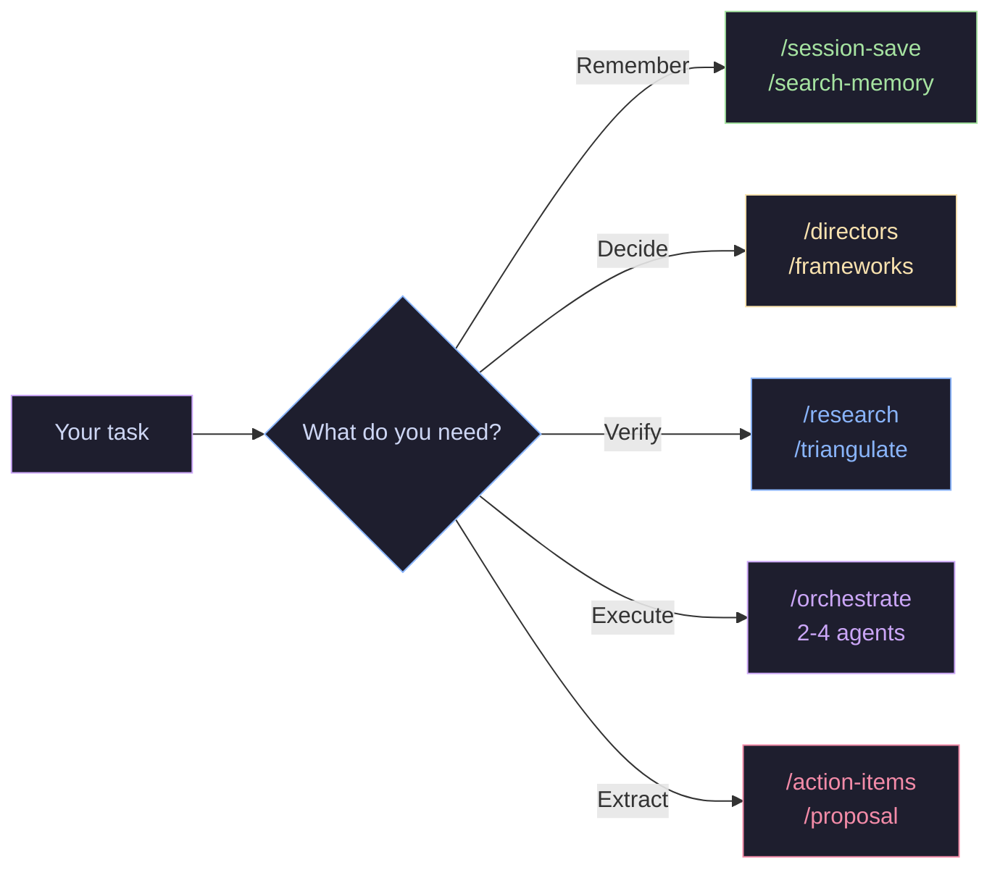

**Progressive disclosure.** Only load what is needed. 100 observations across 10 projects: a search costs ~4,000 tokens. Without progressive disclosure: ~15,000 tokens.

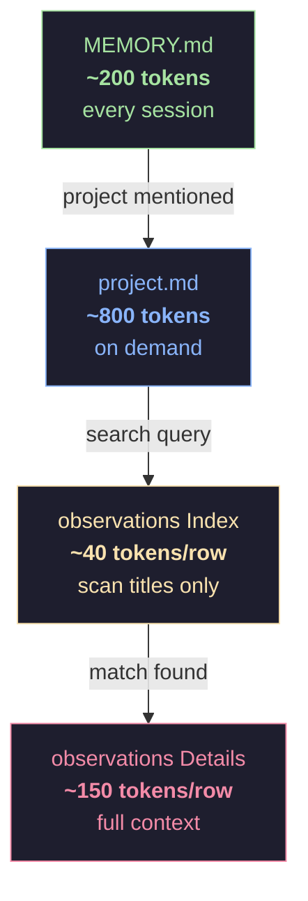

<details>
<summary><strong>What actually gets used (usage stats from 1,169 sessions)</strong></summary>

`/session-save` runs at the end of roughly 70% of sessions. The other 30% are quick questions that do not produce anything worth remembering.

`auto-observe` captures 1 to 3 observations per session automatically. You do not invoke it. It watches for decisions, bugfixes, discoveries, and problems, then appends them to the project's observation log. The most valuable observation types turned out to be **decisions** and **discoveries**. These are knowledge types impossible to reconstruct from code alone. "Why we chose A over B" and "API actually limits 100 req/min." Things that evaporate unless written down in the moment.

`/search-memory` gets used 2 to 3 times per week. The typical query is something like "what did we decide about auth?" The memory system prevented the same JWT-vs-sessions debate from happening 4 times. Four times the agent would have proposed a solution that had already been evaluated and rejected. External declarative memory prevents re-derivation of previously settled conclusions. That alone justified building all of this.

`/directors` gets called for any project above $5k or any architectural decision. Five virtual experts arguing is cheaper than one real regret.

`/frameworks` when starting a new project phase. It picks the relevant subset of 50 frameworks based on your stage. Not all 50 at once. That would be insane.

`/orchestrate` for tasks that need parallel research and implementation. Researcher finds the information, Developer writes the code, Tester validates it. Simultaneously.

`/research` and `/triangulate` for any claim that sounds too good. Trust, then verify. Or just verify.

</details>

<details>
<summary><strong>The dead ends (honesty about failures)</strong></summary>

**Long prompts worked worse than short ones.** We invested serious effort into comprehensive system prompts that anticipated every scenario. The result was worse output. The model gets confused by instruction overload the same way a person does.

**Universal "do everything" skills do not work.** We tried building a single skill that handled research, analysis, and recommendations. Specialization wins. Every time. A `/research` skill and a `/triangulate` skill outperform a single `/research-and-verify` skill.

**Adding all possible skills without deliberation produces noise.** More tools does not mean more capability. It means more context consumed, more busywork, more tokens burned on irrelevant processing. "Agents are precision instruments for jeweler's tasks. When you unleash all agents at once, you get work for work's sake and tokens burned inefficiently."

**Mass agent launches are wasteful.** Five directors evaluating your grocery list is a waste. The car metaphor applies here: you do not floor the accelerator in a parking lot.

</details>

<details>
<summary><strong>Why Markdown and not a database</strong></summary>

Zero dependencies. Works offline. Version-controllable. Readable by humans.

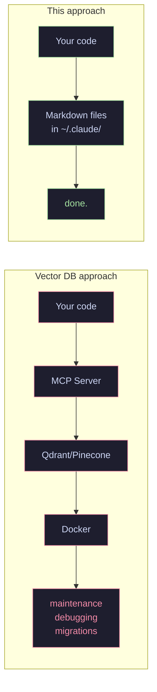

A SQLite database would be faster to query. A vector store would have better semantic search. Both would require installation steps, maintenance, and debugging when they break. Markdown files in a git repo require nothing. They survive OS upgrades, editor changes, and the inevitable migration to the next AI tool.

The non-dogmatic take: "One does not interfere with the other. There are no right tools and wrong tools. Only timely usage and excessive usage." If your project genuinely needs a vector store, use one. A big mistake is trying to use nothing and thinking you are smarter than everyone. Stack should match the task.

</details>

---

## Packs

| | Pack | Skills | What it does |
|:---:|------|--------|-------------|
| :brain: | **[Memory](#memory)** | 5 skills + 3 rules | Your agent remembers yesterday, last week, and that bug from three months ago |
| :bulb: | **[Thinking](#thinking)** | 3 skills | Five virtual experts argue about your project so you don't have to |
| :mag: | **[Research](#research)** | 3 skills | Web research with confidence scores, fact verification, knowledge base |
| :briefcase: | **[Business](#business)** | 1 skill | Call transcript to proposal + architecture + clickable prototype |
| :clipboard: | **[Content](#content)** | 1 skill | Extract tasks from transcripts, chats, documents |
| :bar_chart: | **[Productivity](#productivity)** | 1 skill | Weekly integral review across 4 dimensions |
| :wrench: | **[Meta](#meta)** | 1 skill | Skills library health audit |

---

### Memory

Your agent remembers what happened yesterday. And last week. And that bug you fixed three months ago that is about to happen again.

> Prevented the same JWT-vs-sessions debate from happening 4 times. The agent kept proposing a solution that had already been evaluated and rejected. With memory, settled conclusions stay settled.

**Skills:** `session-save` `search-memory` `memory-health` `memory-init` `project-status`
**Rules:** `session-start` `session-end` `auto-observe`

<p align="center">
  
</p>

How it works:

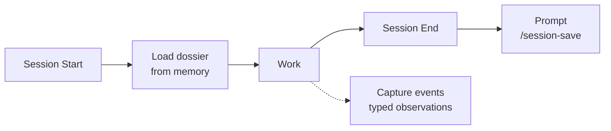

The memory hierarchy uses progressive disclosure to stay token-efficient:

```
MEMORY.md (always loaded, ~200 tokens)
    |
    +-- project.md (on project mention, ~800 tokens)
    |
    +-- project.observations.md
        +-- Index (~40 tokens/row)
        +-- Details (~150 tokens/row, loaded only for matches)
```

With 100 observations across 10 projects, a search costs ~4,000 tokens instead of ~15,000. Your context window says thank you.

> [!NOTE]
> Start with `/memory-init` after installation. It auto-detects your projects and sets up the directory structure.

[Full documentation &#8594;](packs/memory/README.md)

---

### Thinking

Five virtual experts argue about your project. Each one sees everything through their unique lens: product, engineering, UX, business, safety.

> They frequently disagree. No single "best" director. The one who catches what others miss changes every time. The value is in the ensemble, not any single expert.

**Skills:** `directors` `frameworks` `orchestrate`

<p align="center">
  
</p>

<details>
<summary><strong>Directors</strong> -- 5 agents evaluate your project in parallel</summary>

| Director | Lens |
|----------|------|
| **Mira Murati** | Product, rapid iteration, collaborative AI |
| **Ilya Sutskever** | First principles, generalization, long-term |
| **Boris Cherny** | DX, verification loops, institutional memory |
| **Andrej Karpathy** | 1.0/2.0/3.0 stack, verifiability, agent-friendly |
| **Jony Ive** | Care, emotional resonance, simplicity |

Produces a synthesis with consensus, disagreements, top 3 critical questions, and action items.

</details>

<details>
<summary><strong>Frameworks</strong> -- 50 frameworks, activated by project stage</summary>

Determines your project stage (ideation, architecture, MVP, growth, polish, safety), activates the relevant subset of 50 frameworks, applies each one specifically, and surfaces conflicts with resolution rules.

Not all 50 at once. That would be insane.

</details>

<details>
<summary><strong>Orchestrate</strong> -- 2-4 agents in parallel</summary>

Picks from a library of 12 specialized agents based on task keywords. Researcher + Triangulator for fact-finding. Developer + Tester for implementation. Debugger + Developer for fixing things.

Runs them in parallel, synthesizes results into a single report.

</details>

[Full documentation &#8594;](packs/thinking/README.md)

---

### Research

Your agent checks its homework.

**Skills:** `researching-web` `triangulate` `learned-lessons`

<p align="center">
  
</p>

**Research** does web search with source scoring, contradiction detection, and confidence breakdown. Catches when vendor benchmarks contradict independent tests, before you base an architectural decision on marketing claims.

**Triangulate** verifies claims through 3+ independent sources. Classifies each claim as fact, opinion, or prediction. Shows exactly where the confidence comes from. Flags echo bias when sources share the same ecosystem.

**Learned Lessons** keeps a knowledge base of solved problems. After you debug something with web search, it offers to record the solution. Next time a similar problem shows up, it checks the knowledge base first. Your agent stops googling the same error twice.

[Full documentation &#8594;](packs/research/README.md)

---

<!-- Smaller packs: compact 2-column layout -->
<table>
<tr>
<td width="50%" valign="top">

### Business

From "we had a call" to "here is the proposal, architecture, and clickable prototype."

**Skill:** `transcript-to-proposal`


Give it a product description and a call transcript. It extracts pains, maps them to features, generates a proposal using the client's own words, builds system architecture, and creates an interactive HTML prototype.

> "LLMs catch what you missed in conversation. The prototype built with the client's own words leaves an unforgettable impression."

[Full docs &#8594;](packs/business/README.md)

</td>
<td width="50%" valign="top">

### Content

Nobody reads meeting transcripts twice. This skill reads them once and extracts everything actionable.

**Skill:** `action-items`


Handles .txt transcripts, chat exports (JSON/HTML), PDFs, raw text. Produces a prioritized checklist with assignees, deadlines, and source quotes. The hidden superpower: catches **unanswered questions** that everyone agreed were important and nobody followed up on.

[Full docs &#8594;](packs/content/README.md)

</td>
</tr>
<tr>
<td width="50%" valign="top">

### Productivity

A weekly review that looks at more than your commit count.

**Skill:** `aqal-review`


Uses the AQAL integral model to evaluate progress across 4 quadrants (interior/exterior, individual/collective) and 5 development lines. Tracks trends over weeks. Catches the silent killer: IT quadrant climbing while WE quadrant stagnates. You ship code, team communication atrophies, and nobody sees it until it's too late.

[Full docs &#8594;](packs/productivity/README.md)

</td>
<td width="50%" valign="top">

### Meta

Your skills library has a doctor.

**Skill:** `skill-checkup`


Validates file references, frontmatter, trigger uniqueness, and dependency drift. Reports problems. Does not auto-fix. A calm doctor, not a helicopter parent.

[Full docs &#8594;](packs/meta/README.md)

</td>
</tr>
</table>

---

## How It Compares

Different approaches, not competitors. "There are no right tools and wrong tools. Only timely usage and excessive usage."

| Feature | Miracle Infrastructure | memory-bank | claudemem |
|---------|:---------------------:|:-----------:|:---------:|
| Zero dependencies | :white_check_mark: | :x: MCP | :x: MCP |
| Setup under 2 min | :white_check_mark: | :x: | :white_check_mark: |
| Token efficient | :white_check_mark: Progressive disclosure | :x: | :x: |
| Typed observations | :white_check_mark: 5 types + custom | :x: | :x: |
| Self-validating | :white_check_mark: Integrity tests | :x: | :x: |
| Decision making | :white_check_mark: Directors + Frameworks | :x: | :x: |
| Research tools | :white_check_mark: 3 skills | :x: | :x: |
| Works offline | :white_check_mark: | :x: | :x: |

Each of these tools made a deliberate set of tradeoffs. MCP-based systems get tighter integration with external services. Database-backed systems get faster queries at scale. We chose zero dependencies and Markdown because we value portability, readability, and not debugging infrastructure when we should be debugging code. Your situation might call for something different.

> [!IMPORTANT]
> This comparison reflects our understanding of these tools as of February 2026. Features may have changed. If you maintain one of these projects and something is inaccurate, please open an issue.

---

## For AI Researchers

If you work on agentic systems, memory architectures, or human-AI interaction, several findings from 1,169 sessions may be worth your attention.

<p align="center">
  
</p>

**Progressive disclosure as manual RAG without a vector store.** The memory hierarchy (MEMORY.md > project dossiers > observation indices > observation details) implements retrieval-augmented generation through file structure alone. Token cost scales with query specificity, not corpus size. No embeddings, no similarity search, no infrastructure. The tradeoff is obvious: it requires human-designed structure. The benefit is equally obvious: zero failure modes from retrieval errors.

**auto-observe as episodic memory.** The observation system captures typed episodic memories (decision, bugfix, feature, discovery, problem) with mandatory context fields (Before/After, Why). This creates a structured episodic memory that an LLM can query through pattern matching on the index. The most valuable observation types were decisions and discoveries, both of which are impossible to reconstruct from code artifacts alone.

**Mixture-of-experts through prompting.** The Directors system runs one LLM through 5 different system prompts (product, engineering, UX, business, safety lenses). They frequently disagree. Genuinely. No single director consistently outperforms the others. The one who catches what others miss changes every time. This suggests that system prompt variation creates meaningful diversity in reasoning, analogous to mixture-of-experts architectures, without requiring separate models or fine-tuning.

**Constraints improve output quality.** Across 1,169 sessions, structured and constrained prompts consistently outperformed open-ended ones. Shorter prompts outperformed longer prompts. This parallels findings in instruction tuning: specificity and structure in the prompt matter more than exhaustive coverage.

**External declarative memory prevents re-derivation.** Without persistent memory, the agent re-derives conclusions from first principles each session. It proposes solutions already rejected, re-evaluates tradeoffs already settled. External declarative memory (project dossiers with recorded decisions) eliminates this re-derivation, functioning as a persistent belief store that survives context window boundaries.

**The human is the bottleneck.** After 6 months of daily use, the consistent finding is that system performance is limited by the human operator, not the model. The human's context window is smaller, attention is less reliable, and working memory is more fragile. The system's most impactful features are the ones that compensate for human limitations: auto-loading context, auto-capturing decisions, prompting to save state.

---

## For the Curious

<details>
<summary><strong>How progressive disclosure saves tokens</strong></summary>

| What loads | When | Cost |
|-----------|------|------|
| MEMORY.md | Every session | ~200 tokens |
| project.md | On project mention | ~800 tokens |
| observations Index | On search | ~40 tokens/row |
| observations Details | Only for matches | ~150 tokens/row |

100 observations, searching by type: ~4,000 tokens loaded. Without progressive disclosure: ~15,000 tokens. The difference compounds across sessions.

</details>

<details>
<summary><strong>Extension points</strong></summary>

- **Add observation types**: edit `memory-config.json`
- **Add directors**: follow the system prompt pattern in `directors/SKILL.md`
- **Add frameworks**: add to any category, assign to stages
- **Add agents**: edit `agents-library.json`
- **Custom dossier sections**: add any `## Section` to a dossier file

[Full extension guide &#8594;](docs/customization.md)

</details>

<details>
<summary><strong>System architecture</strong></summary>

[See ARCHITECTURE.md for full system diagrams](ARCHITECTURE.md), including:
- Session lifecycle diagram
- Memory hierarchy with token costs
- Data flow between components
- File structure reference

</details>

---

## Background

It started simply: a solo developer got tired of re-explaining his own codebase to his own AI agent. Every Monday morning, same questions. Every architectural decision, re-debated. Every bugfix, forgotten by the next session.

Over 6 months and 1,169 sessions across 10 projects, that frustration became a philosophy about human-AI symbiosis. Not the "AI does everything" version. Not the "AI is just autocomplete" version. The version where a human with a workshop full of the right tools and an agent that extends their thinking can produce work that neither could alone.

The tools grew one at a time, each one solving a specific friction. Memory came first (stop re-explaining). Directors came next (stop making architectural decisions alone at 2am). Research followed (stop trusting the agent's confident-sounding hallucinations). Business skills last (stop losing client insights between the call and the proposal).

Every skill that survived earned its place through repeated use. The ones that did not make the cut, the universal "do everything" skill, the exhaustive system prompts, the mass agent launches, taught us something equally valuable: agents are precision instruments for jeweler's tasks, not sledgehammers.

The name "Miracle Infrastructure" comes from the original project name. The miracle is that it works with zero dependencies.

## License

MIT. Do whatever you want with it.

<p align="center">
  <a href="https://github.com/vasilievyakov/miracle-infrastructure">
    
  </a>
</p>
