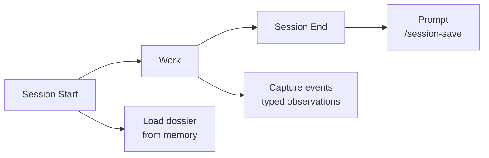

# Miracle Infrastructure

14 skills for Claude Code that actually solve problems.

Not another wrapper. Not another MCP server. Just Markdown files that make your agent remember things, think harder, and do research.

## The Problem

Claude Code forgets everything between sessions. You explain your project architecture on Monday, and by Tuesday it asks what framework you use. Again.

You make a decision about JWT vs sessions on Wednesday. On Thursday, it proposes sessions.

You fix a bug. Next week, the same bug pattern shows up and nobody remembers the fix.

## The Fix

Seven packs of skills that give Claude Code capabilities it should have had from the start:

| Pack | Skills | What it does |
|------|--------|-------------|
| **memory** | 5 skills, 3 rules | Your agent remembers yesterday, last week, and that bug from three months ago |
| **thinking** | 3 skills | Five virtual experts argue about your project so you don't have to |
| **research** | 3 skills | Web research with confidence scores, fact verification, knowledge base |
| **business** | 1 skill | Call transcript to proposal + architecture + clickable prototype |
| **content** | 1 skill | Extract tasks from transcripts, chats, documents |
| **productivity** | 1 skill | Weekly integral review across 4 dimensions |
| **meta** | 1 skill | Skills library health audit |

## Install (2 minutes)

```bash
git clone https://github.com/vasilievyakov/miracle-infrastructure.git
cd miracle-infrastructure
bash install.sh
```

The installer shows an interactive menu. Pick individual packs or install everything.

Copies skill files to `~/.claude/skills/`, rules to `~/.claude/rules/`, and sets up the memory directory. Existing files are backed up before overwriting. Safe to re-run.

**Dependencies: zero.** No Docker, no database, no MCP server, no npm install. Just Markdown files and a bash script.

## Packs

### Memory

Your agent remembers what happened yesterday. And last week. And that bug you fixed three months ago.

5 skills: `session-save`, `search-memory`, `memory-health`, `memory-init`, `project-status`
3 rules: `session-start`, `session-end`, `auto-observe`

How it works:



The memory hierarchy uses progressive disclosure to stay token-efficient:

```
MEMORY.md (always loaded, ~200 tokens)
    |
    +-- project.md (on project mention, ~800 tokens)
    |
    +-- project.observations.md
        +-- Index (~40 tokens/row)
        +-- Details (~150 tokens/row, loaded only for matches)
```

With 100 observations across 10 projects, a search costs ~4,000 tokens instead of ~15,000. Your context window says thank you.

[See packs/memory/README.md for full docs](packs/memory/README.md)

### Thinking

Five virtual experts argue about your project. Each one sees everything (product, engineering, UX, business, safety) through their unique lens.

3 skills: `directors`, `frameworks`, `orchestrate`

**Directors** launches 5 agents in parallel:
- Mira Murati (product, rapid iteration)
- Ilya Sutskever (first principles, long-term)
- Boris Cherny (DX, verification loops)
- Andrej Karpathy (1.0/2.0/3.0 stack)
- Jony Ive (care, simplicity)

**Frameworks** activates the right subset of 50 frameworks based on your project stage. Not all 50 at once. That would be insane.

**Orchestrate** picks 2-4 agents from a library of 12 and runs them in parallel. Researcher + Triangulator for fact-finding. Developer + Tester for implementation. Debugger + Developer for fixing things.

[See packs/thinking/README.md for full docs](packs/thinking/README.md)

### Research

Your agent checks its homework.

3 skills: `researching-web`, `triangulate`, `learned-lessons`

**Research** does web search with source scoring, contradiction detection, and confidence breakdown.

**Triangulate** verifies claims through 3+ independent sources. Classifies each claim as fact, opinion, or prediction. Shows exactly where the confidence comes from.

**Learned Lessons** keeps a knowledge base of solved problems. After you debug something with web search, it offers to record the solution. Next time a similar problem shows up, it checks the knowledge base first.

[See packs/research/README.md for full docs](packs/research/README.md)

### Business

From "we had a call" to "here is the proposal, architecture, and clickable prototype."

1 skill: `transcript-to-proposal`

Give it a product description and a call transcript. It extracts pains, maps them to features, generates a proposal using the client's own words, builds system architecture, and creates an interactive HTML prototype. With checkpoints so you review before it continues.

[See packs/business/README.md for full docs](packs/business/README.md)

### Content

Nobody reads meeting transcripts twice. This skill reads them once and extracts everything actionable.

1 skill: `action-items`

Handles .txt transcripts, chat exports (JSON/HTML), PDFs, raw text. Produces a prioritized checklist with assignees, deadlines, and source quotes.

### Productivity

A weekly review that looks at more than your commit count.

1 skill: `aqal-review`

Uses the AQAL integral model to evaluate progress across 4 quadrants (interior/exterior, individual/collective) and 5 development lines. Tracks trends over weeks.

### Meta

Your skills library has a doctor.

1 skill: `skill-checkup`

Validates file references, frontmatter, trigger uniqueness, and dependency drift. Reports problems. Does not auto-fix. A calm doctor, not a helicopter parent.

## For the Curious

[See ARCHITECTURE.md for full system diagrams](ARCHITECTURE.md)

### How progressive disclosure saves tokens

| What loads | When | Cost |
|-----------|------|------|
| MEMORY.md | Every session | ~200 tokens |
| project.md | On project mention | ~800 tokens |
| observations Index | On search | ~40 tokens/row |
| observations Details | Only for matches | ~150 tokens/row |

100 observations, searching by type: ~4,000 tokens loaded. Without progressive disclosure: ~15,000 tokens. The difference compounds across sessions.

### Extension points

- **Add observation types**: edit `memory-config.json`
- **Add directors**: follow the system prompt pattern
- **Add frameworks**: add to any category, assign to stages
- **Add agents**: edit `agents-library.json`
- **Custom dossier sections**: add any `## Section` to a dossier file

[See docs/customization.md for full extension guide](docs/customization.md)

## How it compares

| Feature | Miracle Infrastructure | Durafen/Qdrant | memory-bank | claudemem |
|---------|----------------------|----------------|-------------|-----------|
| Dependencies | Zero | MCP + Qdrant + Docker | MCP | MCP |
| Setup time | 2 minutes | 30+ minutes | 10 minutes | 5 minutes |
| Token efficient | Yes (progressive disclosure) | No | No | No |
| Typed observations | Yes (5 types + custom) | No | No | No |
| Self-validating | Yes (integrity tests) | No | No | No |
| Decision making | Yes (directors, frameworks) | No | No | No |
| Research tools | Yes (3 skills) | No | No | No |
| Works offline | Yes | No (needs Qdrant) | No (needs MCP) | No |

## Background

Built and battle-tested across 1,169+ sessions and 10 projects over 6 months. Started as personal productivity tools for a solo developer, grew into a system that handles memory, decision-making, research, and business workflows.

The name "Miracle Infrastructure" comes from the original project name. The miracle is that it works with zero dependencies.

## License

MIT. Do whatever you want with it.
