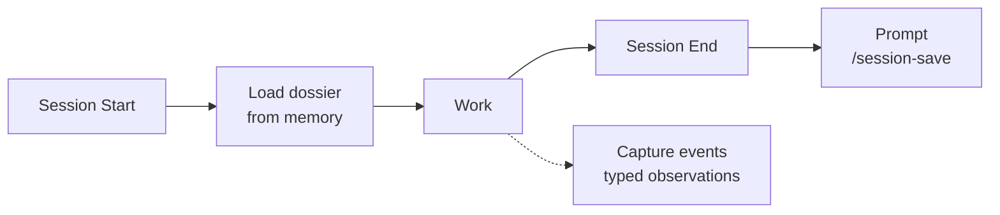

<h1 align="center">Miracle Infrastructure</h1>

<p align="center">
  <em>15 skills that give Claude Code a memory, opinions, and a research department.<br>Zero dependencies. Just Markdown.</em>
</p>

<p align="center">
  <a href="https://github.com/vasilievyakov/miracle-infrastructure/blob/main/LICENSE">
    
  </a>
  
  
  
  
</p>

<p align="center">
  
  
  
</p>

---

## The Problem

Claude Code forgets everything between sessions.

You explain your project architecture on Monday. By Tuesday it asks what framework you use. You make a decision about JWT vs sessions on Wednesday. On Thursday, it proposes sessions. You fix a race condition in token refresh. Next week, the same pattern shows up and nobody remembers the fix.

This is not a minor annoyance. This is your most expensive tool operating at a fraction of its capacity because it has no memory, no judgment, and no way to learn from yesterday.

Miracle Infrastructure fixes that. Fifteen skills, seven packs, zero dependencies. Your agent remembers decisions, argues with itself before committing to architecture, verifies claims through multiple sources, and builds proposals from call transcripts.

All of it is Markdown files. No servers. No databases. No Docker containers pretending to be simple.

## Install

```bash
git clone https://github.com/vasilievyakov/miracle-infrastructure.git
cd miracle-infrastructure && bash install.sh
```

<p align="center">
  
</p>

> [!TIP]
> The installer shows an interactive menu. Pick individual packs or install everything. Existing files are backed up before overwriting. Safe to re-run.

**2 minutes. Zero dependencies.** No Docker, no database, no MCP server, no npm. Just Markdown and bash.

---

## Contents

- [How We Actually Use This](#how-we-actually-use-this)
- [Packs](#packs)
  - [Memory](#memory) -- session persistence, typed observations
  - [Thinking](#thinking) -- directors, frameworks, agent orchestrator
  - [Research](#research) -- web research, triangulation, knowledge base
  - [Business](#business) -- transcript to proposal + prototype
  - [Content](#content) -- extract action items from text
  - [Productivity](#productivity) -- weekly integral review
  - [Meta](#meta) -- skills library health audit
- [How It Compares](#how-it-compares)
- [Architecture](#for-the-curious)
- [Background](#background)
- [License](#license)

---

## How We Actually Use This

This section exists because every tool's README promises the moon. Here is what actually happens across 1,169 sessions and 10 projects over 6 months.

### What skills are

Skills are Markdown files. Not code. Not plugins. Not compiled binaries.

They modify Claude's behavior through context injection. When you type `/directors`, Claude doesn't execute a program. It loads a Markdown file that restructures how it thinks about your question. The skill defines personas, evaluation criteria, output format. Claude does the rest.

This means skills have zero runtime dependencies. They work offline. They version-control with git. You can read every skill in a text editor and understand exactly what it does. Try that with an MCP server.

### What actually gets used

`/session-save` runs at the end of roughly 70% of sessions. The other 30% are quick questions that don't produce anything worth remembering.

`auto-observe` captures 1 to 3 observations per session automatically. You don't invoke it. It watches for decisions, bugfixes, discoveries, and problems, then appends them to the project's observation log.

`/search-memory` gets used 2 to 3 times per week. The typical query is something like "what did we decide about auth?" or "when did we fix the token refresh bug?" The memory system prevented the same JWT-vs-sessions debate from happening 4 times. That alone justified building all of this.

`/directors` gets called for any project above $5k or any architectural decision. Five virtual experts arguing is cheaper than one real regret.

`/frameworks` when starting a new project phase. It picks the relevant subset of 50 frameworks based on your stage. Not all 50 at once. That would be insane.

`/orchestrate` for tasks that need parallel research and implementation. Researcher finds the information, Developer writes the code, Tester validates it. Simultaneously.

`/research` and `/triangulate` for any claim that sounds too good. Trust, then verify. Or just verify.

### Why Markdown and not a database

Zero dependencies. Works offline. Version-controllable. Readable by humans.

A SQLite database would be faster to query. A vector store would have better semantic search. Both would require installation steps, maintenance, and debugging when they break. Markdown files in a git repo require nothing. They survive OS upgrades, editor changes, and the inevitable migration to the next AI tool.

### Design principles

**Progressive disclosure.** Only load what's needed. MEMORY.md costs ~200 tokens every session. A project dossier costs ~800 tokens when you mention that project. Observation details load only when they match a search. With 100 observations across 10 projects, a search costs ~4,000 tokens instead of ~15,000.

**The system is opinionated.** Observations have types (decision, bugfix, feature, discovery, problem). History is append-only. Problems track resolution status. You can extend the types, you cannot remove the structure. Constraints make the data useful six months later.

**Design for the model 6 months from now.** The interfaces are stable. The capabilities will improve. A skill that produces good results with today's model will produce better results with tomorrow's model, because the structure is right. Don't optimize for current limitations. Optimize for the contract.

---

## Packs

| | Pack | Skills | What it does |
|:---:|------|--------|-------------|
| :brain: | **[Memory](#memory)** | 5 skills + 3 rules | Your agent remembers yesterday, last week, and that bug from three months ago |
| :bulb: | **[Thinking](#thinking)** | 3 skills | Five virtual experts argue about your project so you don't have to |
| :mag: | **[Research](#research)** | 3 skills | Web research with confidence scores, fact verification, knowledge base |
| :briefcase: | **[Business](#business)** | 1 skill | Call transcript to proposal + architecture + clickable prototype |
| :clipboard: | **[Content](#content)** | 1 skill | Extract tasks from transcripts, chats, documents |
| :bar_chart: | **[Productivity](#productivity)** | 1 skill | Weekly integral review across 4 dimensions |
| :wrench: | **[Meta](#meta)** | 1 skill | Skills library health audit |

---

### Memory

Your agent remembers what happened yesterday. And last week. And that bug you fixed three months ago that is about to happen again.

**Skills:** `session-save` `search-memory` `memory-health` `memory-init` `project-status`
**Rules:** `session-start` `session-end` `auto-observe`

<p align="center">
  
</p>

How it works:



The memory hierarchy uses progressive disclosure to stay token-efficient:

```
MEMORY.md (always loaded, ~200 tokens)
    |
    +-- project.md (on project mention, ~800 tokens)
    |
    +-- project.observations.md
        +-- Index (~40 tokens/row)
        +-- Details (~150 tokens/row, loaded only for matches)
```

With 100 observations across 10 projects, a search costs ~4,000 tokens instead of ~15,000. Your context window says thank you.

> [!NOTE]
> Start with `/memory-init` after installation. It auto-detects your projects and sets up the directory structure.

[Full documentation &#8594;](packs/memory/README.md)

---

### Thinking

Five virtual experts argue about your project. Each one sees everything through their unique lens: product, engineering, UX, business, safety.

**Skills:** `directors` `frameworks` `orchestrate`

<p align="center">
  
</p>

<details>
<summary><strong>Directors</strong> -- 5 agents evaluate your project in parallel</summary>

| Director | Lens |
|----------|------|
| **Mira Murati** | Product, rapid iteration, collaborative AI |
| **Ilya Sutskever** | First principles, generalization, long-term |
| **Boris Cherny** | DX, verification loops, institutional memory |
| **Andrej Karpathy** | 1.0/2.0/3.0 stack, verifiability, agent-friendly |
| **Jony Ive** | Care, emotional resonance, simplicity |

Produces a synthesis with consensus, disagreements, top 3 critical questions, and action items.

</details>

<details>
<summary><strong>Frameworks</strong> -- 50 frameworks, activated by project stage</summary>

Determines your project stage (ideation, architecture, MVP, growth, polish, safety), activates the relevant subset of 50 frameworks, applies each one specifically, and surfaces conflicts with resolution rules.

Not all 50 at once. That would be insane.

</details>

<details>
<summary><strong>Orchestrate</strong> -- 2-4 agents in parallel</summary>

Picks from a library of 12 specialized agents based on task keywords. Researcher + Triangulator for fact-finding. Developer + Tester for implementation. Debugger + Developer for fixing things.

Runs them in parallel, synthesizes results into a single report.

</details>

[Full documentation &#8594;](packs/thinking/README.md)

---

### Research

Your agent checks its homework.

**Skills:** `researching-web` `triangulate` `learned-lessons`

<p align="center">
  
</p>

**Research** does web search with source scoring, contradiction detection, and confidence breakdown.

**Triangulate** verifies claims through 3+ independent sources. Classifies each claim as fact, opinion, or prediction. Shows exactly where the confidence comes from.

**Learned Lessons** keeps a knowledge base of solved problems. After you debug something with web search, it offers to record the solution. Next time a similar problem shows up, it checks the knowledge base first. Your agent stops googling the same error twice.

[Full documentation &#8594;](packs/research/README.md)

---

### Business

From "we had a call" to "here is the proposal, architecture, and clickable prototype."

**Skill:** `transcript-to-proposal`

<p align="center">
  
</p>

Give it a product description and a call transcript. It extracts pains, maps them to features, generates a proposal using the client's own words, builds system architecture, and creates an interactive HTML prototype. With checkpoints so you review before it continues.

[Full documentation &#8594;](packs/business/README.md)

---

### Content

Nobody reads meeting transcripts twice. This skill reads them once and extracts everything actionable.

**Skill:** `action-items`

<p align="center">
  
</p>

Handles .txt transcripts, chat exports (JSON/HTML), PDFs, raw text. Produces a prioritized checklist with assignees, deadlines, and source quotes.

[Full documentation &#8594;](packs/content/README.md)

---

### Productivity

A weekly review that looks at more than your commit count.

**Skill:** `aqal-review`

<p align="center">
  
</p>

Uses the AQAL integral model to evaluate progress across 4 quadrants (interior/exterior, individual/collective) and 5 development lines. Tracks trends over weeks. Tells you when you're shipping features at the cost of team health, or growing personally while the codebase rots.

[Full documentation &#8594;](packs/productivity/README.md)

---

### Meta

Your skills library has a doctor.

**Skill:** `skill-checkup`

<p align="center">
  
</p>

Validates file references, frontmatter, trigger uniqueness, and dependency drift. Reports problems. Does not auto-fix. A calm doctor, not a helicopter parent.

[Full documentation &#8594;](packs/meta/README.md)

---

## How It Compares

| Feature | Miracle Infrastructure | memory-bank | claudemem |
|---------|:---------------------:|:-----------:|:---------:|
| Zero dependencies | :white_check_mark: | :x: MCP | :x: MCP |
| Setup under 2 min | :white_check_mark: | :x: | :white_check_mark: |
| Token efficient | :white_check_mark: Progressive disclosure | :x: | :x: |
| Typed observations | :white_check_mark: 5 types + custom | :x: | :x: |
| Self-validating | :white_check_mark: Integrity tests | :x: | :x: |
| Decision making | :white_check_mark: Directors + Frameworks | :x: | :x: |
| Research tools | :white_check_mark: 3 skills | :x: | :x: |
| Works offline | :white_check_mark: | :x: | :x: |

> [!IMPORTANT]
> This comparison reflects our understanding of these tools as of February 2026. Features may have changed. If you maintain one of these projects and something is inaccurate, please open an issue.

---

## For the Curious

<details>
<summary><strong>How progressive disclosure saves tokens</strong></summary>

| What loads | When | Cost |
|-----------|------|------|
| MEMORY.md | Every session | ~200 tokens |
| project.md | On project mention | ~800 tokens |
| observations Index | On search | ~40 tokens/row |
| observations Details | Only for matches | ~150 tokens/row |

100 observations, searching by type: ~4,000 tokens loaded. Without progressive disclosure: ~15,000 tokens. The difference compounds across sessions.

</details>

<details>
<summary><strong>Extension points</strong></summary>

- **Add observation types**: edit `memory-config.json`
- **Add directors**: follow the system prompt pattern in `directors/SKILL.md`
- **Add frameworks**: add to any category, assign to stages
- **Add agents**: edit `agents-library.json`
- **Custom dossier sections**: add any `## Section` to a dossier file

[Full extension guide &#8594;](docs/customization.md)

</details>

<details>
<summary><strong>System architecture</strong></summary>

[See ARCHITECTURE.md for full system diagrams](ARCHITECTURE.md), including:
- Session lifecycle diagram
- Memory hierarchy with token costs
- Data flow between components
- File structure reference

</details>

---

## Background

Built and battle-tested across 1,169+ sessions and 10 projects over 6 months. Started as personal productivity tools for a solo developer who got tired of re-explaining his own codebase to his own AI agent. Grew into a system that handles memory, decision-making, research, and business workflows.

The name "Miracle Infrastructure" comes from the original project name. The miracle is that it works with zero dependencies.

## License

MIT. Do whatever you want with it.

<p align="center">
  <a href="https://github.com/vasilievyakov/miracle-infrastructure">
    
  </a>
</p>
