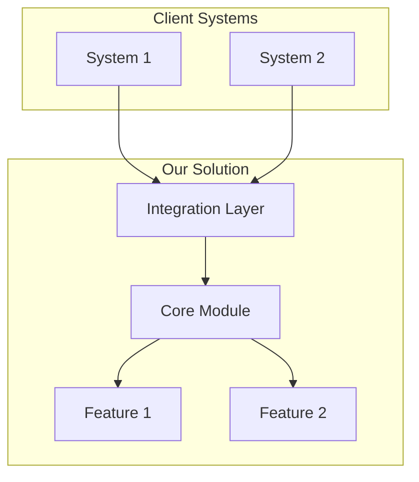

# Transcript to Proposal

Turns a client call transcript into a commercial proposal with architecture and a clickable prototype.

---

## Step 0: Get input documents

**Two documents required:**

1. **Product description**: what you sell, capabilities, integrations
2. **Call transcript**: recording of the conversation with the client

**Action:** If the user did not attach both documents, ask for the missing one:

```
To create the proposal I need two documents:

1. Product description (markdown): what you sell, capabilities, integrations
2. Call transcript with the client

Attach files or paste text.
```

**Do not proceed to the next step until you have both documents.**

---

## Step 1: Analyze client pains

Read the transcript and extract ALL client pains.

### Classify each pain

| Dimension | Options |
|-----------|---------|
| **Level** | Strategic (business) / Tactical (processes) / Operational (daily problems) |
| **Urgency** | Trigger (buying now) / Active (searching for solution) / Latent (aware, passive) |
| **Speaker role** | Decision maker / Influencer / User |

### Trigger event markers (highest priority)

Look for phrases:
- "Management is asking...", "By end of quarter..."
- "We already tried X, it does not work..."
- "Audit revealed...", "Regulator requires..."
- Any external deadlines, pressure from above

### Output format

```markdown
## Client Pains

### 1. [Pain name]
- **Quote:** "[exact quote from transcript]"
- **Level:** Strategic | Tactical | Operational
- **Urgency:** Trigger | Active | Latent
- **Speaker:** [role]
```

---

## Checkpoint 1: Confirm pains

**Show the user the analysis:**

```
Found N pains in the transcript:

TRIGGER (main proposal focus):
   - [pain] - "[quote]"

Active problems:
   - [pain] - "[quote]"

Latent:
   - [pain]

Questions:
1. Priorities correct?
2. Anything missed?
3. Context I cannot see in the transcript?
```

**Wait for user response. Do not continue without confirmation.**

---

## Step 2: Map to product

For each confirmed pain, find in the product description:

1. **Which feature solves** this pain
2. **How exactly** (mechanism)
3. **Proof** (case from description or logical reasoning)

### Solution map

```markdown
## Solution Map

| Client Pain | Product Feature | How it solves | Proof |
|-------------|----------------|---------------|-------|
| [pain 1] | [feature] | [mechanism] | [case/logic] |
```

### Solution architecture

Based on the solution map, create a system diagram:



---

## Checkpoint 2: Confirm architecture

**Show the user:**

```
Proposed architecture:

[Mermaid diagram]

Key decisions:
1. [Decision] - because client said "[quote]"
2. [Decision] - because the product has [feature]

Questions:
1. Architecture clear?
2. Any constraints (budget, stack, timeline)?
3. Need to adjust scope?
```

**Wait for user response. Do not continue without confirmation.**

---

## Step 3: Generate the proposal

Create file `proposal.md`:

```markdown
# Commercial Proposal for [Client Name]

## Summary

- **Problem:** [main trigger pain in client's words]
- **Solution:** [what we propose, one sentence]
- **Outcome:** [specific result]

## Understanding the Situation

[Rephrase client pains using THEIR words from the transcript]

[Show you understand context: why now, what was tried, what did not work]

## Proposed Solution

[Architecture: insert Mermaid diagram]

### Solution Components

**[Component 1]**
- What it does: [description]
- Solves pain: "[pain quote]"

**[Component 2]**
- What it does: [description]
- Solves pain: "[pain quote]"

## Implementation Phases

### Phase 1: [Quick win, solves trigger pain]
- What we do: [specifics]
- Result: [what client gets]

### Phase 2: [Core functionality]
- What we do: [specifics]
- Result: [what client gets]

### Phase 3: [Expansion]
- What we do: [specifics]
- Result: [what client gets]

## Expected Results

| Pain | Metric before | Metric after |
|------|--------------|-------------|
| [pain 1] | [current state] | [expected] |

## Next Steps

1. [Specific action]
2. [Specific action]
```

### Writing rules

- **Use client's words**: copy phrases from the transcript
- **Every claim is traceable**: pain -> feature -> result
- **No marketing fluff**: only specifics
- **What is included, what is not**: state boundaries explicitly

---

## Step 4: Create prototype

Create an interactive HTML prototype demonstrating the solution for the MAIN pain (trigger event).

### Prototype scope

- **1-2 screens maximum**
- **Focus on trigger pain**: show how exactly it gets solved
- **Realistic data**: use context from the transcript

### Technical requirements

- Single HTML file with embedded CSS/JS
- Tailwind CSS via CDN
- Dark theme, modern design
- Responsive layout
- Interactive elements (no backend needed)

### What the prototype should include

1. **Header** with client name (as if it is their system)
2. **Main screen**: solution for the trigger pain
3. **Data**: relevant to client context (names, metrics, regions from transcript)
4. **Navigation**: hint at other capabilities

---

## Final output

Create three files in the current directory:

1. **`proposal.md`**: commercial proposal
2. **`architecture.md`**: technical architecture with Mermaid diagrams
3. **`prototype.html`**: clickable prototype

**After creating files:**

```
Done! Created three files:

proposal.md: commercial proposal
architecture.md: solution architecture
prototype.html: interactive prototype

Open the prototype in the browser?
```
