# Memory Pack

Claude Code forgets everything between sessions. This pack makes it remember.

<p align="center">
  
</p>

## The Idea

You explain your project architecture on Monday. On Tuesday, Claude asks what framework you use. Again. On Wednesday, you have the same JWT-vs-sessions debate for the fourth time.

The memory pack is a file-based memory system that loads context automatically, captures events as they happen, and saves everything when you're done. No databases. No external services. Just markdown files and a few rules that know when to read them.

## What's Inside

### Skills (5)

| Skill | Command | What it does |
|-------|---------|--------------|
| **session-save** | `/session-save` | Saves session context to project memory |
| **search-memory** | `/search-memory` | Queries observations with progressive disclosure |
| **memory-health** | `/memory-health` | Validates memory system integrity |
| **memory-init** | `/memory-init` | First-run setup wizard |
| **project-status** | `/project-status` | Quick status from dossier + git |

### Rules (3)

| Rule | Trigger | What it does |
|------|---------|--------------|
| **session-start** | Every session begins | Loads project dossier automatically |
| **session-end** | Session wraps up | Reminds to save context |
| **auto-observe** | During work | Captures significant events as typed observations |

### Templates

| File | Purpose |
|------|---------|
| `MEMORY.md` | Empty memory index, the root of everything |
| `memory-config.json` | Project keyword mapping |
| `example-project.md` | Sample project dossier |
| `example-project.observations.md` | Sample observations file |

### Tests

`test_memory_integrity.py` validates consistency across all memory files. Catches broken cross-references, orphaned dossiers, and stale observation indexes.

## How It Works

### The session lifecycle

Every session follows the same pattern. No exceptions, no special cases.

```
Start ────> Load ────> Work ────> End ────> Save
  │           │          │         │          │
  v           v          v         v          v
session    read       auto-    session    /session-save
begins    dossier    observe   ending     writes dossier
```

<p align="center">
  
</p>

### Memory hierarchy (progressive disclosure)

The system loads the minimum it needs. Not everything at once. That would be insane.

```
MEMORY.md (~200 tokens, always loaded)
│
├── project.md (~800 tokens, loaded on project mention)
│
└── project.observations.md
    ├── Index (~40 tokens/row, scanned for matches)
    └── Details (~150 tokens/row, loaded only for hits)
```

With 100 observations across 10 projects, a search costs ~4,000 tokens instead of ~15,000. The hierarchy pays for itself after about three sessions.

### Observation types

Events get captured as they happen. Five types cover everything worth remembering.

| Type | When it fires | Example |
|------|---------------|---------|
| `decision` | Architectural/tech/business choice | "Chose JWT over sessions" |
| `bugfix` | Bug found and fixed | "Race condition in token refresh" |
| `feature` | New functionality added | "Added /api/status endpoint" |
| `discovery` | Unexpected fact learned | "API limits 100 req/min" |
| `problem` | Issue found, not yet resolved | "Memory leaks above 1k records" |

Custom types can be added in `memory-config.json`. Most people never need to.

### Config-driven project detection

Projects are defined in `memory-config.json`, not hardcoded anywhere:

```json
{
  "projects": {
    "my-app": {
      "keywords": ["my-app", "dashboard", "admin panel"],
      "github": "user/my-app",
      "path": "~/projects/my-app"
    },
    "api-service": {
      "keywords": ["api", "backend", "service"],
      "github": "user/api-service",
      "path": "~/projects/api-service"
    }
  },
  "fallback_project": "general"
}
```

The `session-start` rule reads this config to match user input to the right dossier. The `path` field enables matching by working directory, so you don't even need to say the project name.

<p align="center">
  
</p>

## Quick Start

1. Run `/memory-init` to create the directory structure and templates
2. Add your projects to `~/.claude/memory/memory-config.json`
3. Work normally. Observations get captured automatically
4. At end of session, run `/session-save`
5. Next session, context loads on its own. No commands needed

## Real Usage

`/session-save` runs at the end of roughly 70% of sessions. The other 30% are quick question-and-answer exchanges that don't produce anything worth remembering.

The most valuable outcome so far: preventing the same JWT-vs-sessions debate from happening four separate times across two weeks. The dossier had the decision, the reasoning, and the tradeoffs. Session loaded it. Debate prevented. Everyone moved on.

Search gets used less often, maybe once or twice a week. Typical query: "what was that rate limiting issue we hit in March?" The progressive disclosure system means you get the answer in ~4,000 tokens, not a dump of every observation ever recorded.

## Extension Points

- **Add observation types**: Edit the `observation_types` array in `memory-config.json`
- **Custom dossier sections**: Add any `## Section` to a dossier file. The system preserves unknown sections during updates
- **Project auto-detection**: The `path` field in config enables matching by working directory, not just keywords
- **Integrity checks**: Run `python3 ~/.claude/memory/tests/test_memory_integrity.py` directly, or use `/memory-health` for the friendly version
