# Research Pack

Your agent checks its homework. Three tools for finding, verifying, and never searching for the same thing twice.

<p align="center">
  
</p>

## The Idea

Claude Code can search the web. That's the easy part. The hard part is knowing whether the answer is any good. These skills add structure: confidence scores, source hierarchies, contradiction detection, claim classification, and a persistent knowledge base so solved problems stay solved.

## What's Inside

### Skills (3)

| Skill | Command | What it does |
|-------|---------|--------------|
| **researching-web** | `/research` | Web research with parallel search, source scoring, confidence breakdown |
| **triangulate** | `/triangulate` | Claim verification through 3+ independent sources |
| **learned-lessons** | `/til` | Knowledge base that accumulates solutions to solved problems |

## How It Works

### Research Pipeline

Every research query passes through the same pipeline. No shortcuts, even for "simple" questions. Simple questions finish the pipeline faster, not differently.

```
Query
  ↓
Classify (factual? comparison? exploratory?)
  ↓
Search (parallel, multiple providers)
  ↓
Score sources (authority, freshness, independence)
  ↓
Extract facts + contradictions
  ↓
Synthesize (format matches query type)
  ↓
Verify (cross-reference key claims)
  ↓
Output with confidence breakdown
```

Every research output includes:
- **Confidence score** with component breakdown (source quality, consensus, freshness)
- **Source quality ratings** (official docs > peer-reviewed > blog posts > forum answers)
- **Contradiction detection** between sources (when Stack Overflow disagrees with the docs, you should know)
- **Research depth stats** (pages analyzed, facts extracted, time spent)

The output format adapts automatically. "X vs Y" queries get comparison tables. Simple questions get chat answers. Complex topics get full HTML reports.

### Source Hierarchy

Not all sources are equal. The skill ranks them:

| Tier | Source type | Weight |
|------|-----------|--------|
| 1 | Official documentation, specs | Highest |
| 2 | Peer-reviewed, academic | High |
| 3 | Established tech blogs, known authors | Medium |
| 4 | Stack Overflow, community forums | Lower |
| 5 | AI-generated content, unknown blogs | Lowest |

When two sources contradict each other, tier matters. The higher-tier source gets the benefit of the doubt, with the contradiction flagged in the output.

<p align="center">
  
</p>

### Triangulate

Fact verification with transparency. The skill classifies the claim type first, because verifying a fact and evaluating a prediction are fundamentally different tasks.

| Claim type | Goal | Possible verdicts |
|------------|------|-------------------|
| **Fact** | True or false | CONFIRMED, REFUTED, PARTIAL |
| **Opinion** | Map positions | CONSENSUS, DIVIDED, MARGINAL |
| **Prediction** | How well-founded | WELL-FOUNDED, SPECULATIVE |

The skill also flags structural problems with the evidence:

| Flag | Meaning |
|------|---------|
| **Bias** | All sources lean the same direction |
| **Echo** | Sources cite each other (circular evidence) |
| **Outdated** | Key sources are more than 2 years old |
| **Insufficient** | Fewer than 3 independent sources found |

A claim can be CONFIRMED and still flagged. "Yes, every source agrees, and they all copy from the same blog post" is different from genuine consensus.

### Learned Lessons

The "never search twice" system. A knowledge base that grows from solved problems.

1. After a web search solves a technical problem, the skill offers to record the lesson
2. During future debugging, it checks the knowledge base first
3. Each lesson stores: problem description, symptoms, solution, tags

The knowledge base lives in your memory directory. It persists across sessions. Six months from now, when you hit the same CORS issue, the answer is already there. No web search needed.

## Quick Start

1. Install the pack
2. Try `/research` on a technical question you'd normally Google
3. Try `/triangulate` on a claim that sounds too good to be true
4. After solving a tricky bug, let `/til` record the lesson
5. Hit the same bug later. Watch it find the answer locally

## Real Usage

`/triangulate` gets invoked anytime something sounds too good. "This library handles 1M requests per second on a single core." Really? Three independent sources or it didn't happen. The bias and echo flags have caught circular evidence chains that would have wasted days.

`/research` replaced most manual Googling for technical questions. The confidence breakdown is the key feature. A 40% confidence answer with good source diversity is often more useful than a 90% confidence answer from a single blog post, because at least you know what you don't know.

`/til` has about 30 entries after four months. That sounds small. It has prevented roughly 30 identical web searches. The CORS lesson alone has been retrieved five times.

## Extension Points

- **Custom source tiers**: Adjust the source hierarchy for your domain (internal wikis, specific documentation sites)
- **Claim type expansion**: Add domain-specific claim types beyond fact/opinion/prediction
- **Knowledge base tags**: Use consistent tags in `/til` to enable filtered retrieval later
- **Search providers**: Works with any web search tools available to Claude Code (Exa, Tabstack, WebSearch, WebFetch, MCP). Degrades gracefully if specific tools are unavailable
