# Thinking Pack

Five experts argue about your project so you don't have to.

<p align="center">
  
</p>

## The Idea

You have a decision to make. You could think about it yourself. Or you could launch five AI directors in parallel, each channeling a different expert perspective, and get a synthesized report with consensus, disagreements, and concrete next steps.

The thinking pack gives Claude Code structured decision-making tools that go beyond "think harder." Three skills, each attacking the problem from a different angle: expert panels, analytical frameworks, and multi-agent orchestration.

### Field Notes (1169 sessions, 6 months)

The directors disagree frequently. That is the point. There is no single "best" director. The one who catches the blind spot changes every time. One week Karpathy spots the architecture flaw. Next week Ive notices the UX incoherence that everyone else walked past. The value is in the ensemble, not in any individual voice.

This is a PhD-level insight hiding in plain sight: one LLM, channeled through different system prompts, produces genuine diversity of thought. It is mixture-of-experts through prompting. Same model, different lenses, different conclusions.

## What's Inside

### Skills (3)

| Skill | Command | What it does |
|-------|---------|--------------|
| **directors** | `/directors` | 5-director virtual advisory board, each evaluating through a unique lens |
| **frameworks** | `/frameworks` | 50 frameworks organized by project stage, with conflict resolution |
| **orchestrate** | `/orchestrate` | 2-4 specialized agents working in parallel on complex tasks |

### Supporting Files

| File | Purpose |
|------|---------|
| `agents-library.json` | 12 agent definitions with system prompts, specializations, and keyword triggers |

## How It Works

### Directors

Five expert lenses evaluate your project simultaneously. Not sequentially. Simultaneously.

| Director | Lens |
|----------|------|
| **Mira Murati** | Product vision, rapid iteration, collaborative AI, ethics |
| **Ilya Sutskever** | First principles, generalization, long-term horizon |
| **Boris Cherny** | Developer experience, verification loops, parallelization, institutional memory |
| **Andrej Karpathy** | 1.0/2.0/3.0 stack, verifiability, agent-friendly architecture |
| **Jony Ive** | Care, emotional resonance, simplicity, material integrity |

Each director evaluates EVERYTHING: product, engineering, UX, business, safety. Through their unique perspective. The synthesis shows where they agree (strong signal) and where they disagree (that's where the interesting problems live).

The output format:

```
Per-director assessment (5x parallel)
    ↓
Consensus points (all agree → high confidence)
    ↓
Disagreement points (divergence → needs attention)
    ↓
Synthesized recommendation (weighted by relevance)
```

<p align="center">
  
</p>

### Frameworks

50 frameworks across 6 project stages. The skill detects your current stage and activates only the relevant ones. Nobody needs all 50 at once. That would be insane.

| Stage | Frameworks activated |
|-------|---------------------|
| **Ideation** | First Principles, JTBD, Inversion, Chesterton's Fence, ... |
| **Architecture** | KISS, SOLID, Conway's Law, 12-Factor, ... |
| **MVP** | YAGNI, Worse is Better, Build-Measure-Learn, Pareto, ... |
| **Growth** | RICE, North Star, Kano, Autonomy Slider, ... |
| **Polish** | Dieter Rams, Progressive Disclosure, Jakob's Law, ... |
| **Safety** | Second-Order Thinking, POLA, Jagged Intelligence, ... |

The best part: frameworks disagree with each other. YAGNI says "don't build it yet." Future-proofing says "you'll regret that." The skill surfaces these conflicts explicitly, with a resolution table:

| Conflict | Framework A | Framework B | Resolution criteria |
|----------|-------------|-------------|---------------------|
| Scope | YAGNI | Future-proofing | Timeline: <3mo → YAGNI, >3mo → invest |
| Complexity | KISS | SOLID | Team size: solo → KISS, team → SOLID |
| Speed | Worse is Better | Quality | Reversibility: reversible → speed, not → quality |

<p align="center">
  
</p>

### Orchestrate

12 specialized agents. The orchestrator reads your task, selects 2-4 that fit, launches them simultaneously, and synthesizes the results.

| Agent | Specialization |
|-------|---------------|
| Researcher | Web search, 3+ sources |
| Developer | Code, TypeScript/Python/React |
| Debugger | Root cause analysis |
| DevOps | Deploy, CI/CD |
| Analyst | Business analysis |
| Designer | UI/UX |
| Writer | Content, documentation |
| Strategist | Planning, roadmap |
| CTO | Code review, security |
| Triangulator | Fact verification |
| Tester | TDD, edge cases |
| Deep Thinker | Contrarian analysis |

Keyword mapping handles auto-selection. Say "deploy" and DevOps gets called. Say "why is this slow" and Debugger + Developer show up. You can also specify agents manually if the auto-selection picks wrong.

**A critical lesson from real use:** when you unleash all agents at once, you get work for work's sake and tokens burned inefficiently. Agents are precision instruments for a jeweler's task, not a bulldozer for every problem. Think of it like driving: sometimes automatic, sometimes manual. Sometimes handbrake, sometimes brake pedal. The skill that matters is knowing which mode fits the moment.

## Quick Start

1. Install the pack (skills + `agents-library.json`)
2. Try `/directors` on a real decision you're facing
3. Try `/frameworks` when starting a new project phase
4. Try `/orchestrate` for any task that benefits from multiple perspectives
5. Edit `agents-library.json` to add your own specialized agents

## Real Usage

`/directors` gets used for any decision above roughly $5,000 in impact. Architecture choices, technology bets, hiring decisions. The disagreement section is consistently the most valuable part, because it shows where you need more information before committing. No single director is reliably "right." The one who catches the blind spot rotates unpredictably. That is exactly why you run all five.

`/frameworks` runs at every new project phase. The stage detection is surprisingly accurate. When it picks wrong, override it manually. The conflict resolution table has prevented more premature optimization than any code review. The key is stage-appropriate activation. Running all 50 frameworks on every question would produce noise, not insight.

`/orchestrate` handles the messy tasks. "Research this company, draft an email, and check if our API supports their format." Three agents, parallel execution, one synthesized answer. Faster than doing them sequentially. Notably better than asking Claude to "just figure it out" in a single pass. The restraint is in knowing when NOT to orchestrate. A simple question deserves a simple answer, not a committee.

## Extension Points

- **Add directors**: Follow the system prompt pattern in the skill file. Each director needs a lens, not a job title
- **Add frameworks**: Add to any category, assign to stages. The system handles activation and conflict detection
- **Add agents**: Edit `agents-library.json`, add keyword mappings. New agents are available to `/orchestrate` immediately
- **Custom conflict rules**: Add resolution criteria to the frameworks skill for your specific domain tradeoffs
